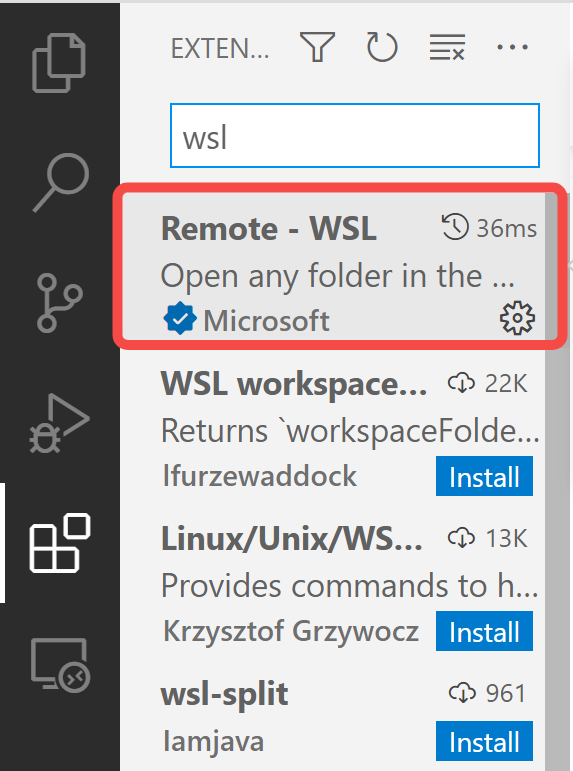

# OS161开发环境配置

**注意： 该文档基于我的个人理解，倘若有不正确之处，还请及时指出！谢谢！**

该文档主要介绍如何搭建os161的开发环境，当前我们有两种可以选择的开发环境，一是在CSE服务器的VLAB环境中，二是在本地的环境中，考虑到大家可能使用的操作系统环境不尽相同以及我对于MacOS，非Debian based发行版并不熟悉。所以该文档主要面向Windows和Linux（Debian based distro）用户。不过事实上，在UNSW的wiki上已经有配置本地环境的教程，大家也可以参考[UNSW官方的教程](https://wiki.cse.unsw.edu.au/cs3231cgi/Setup/Overview)。该文档的意义在于基于我个人的知识介绍一下一些配置环境上的细节，以及补充一下wiki上所没有的信息。

# vscode调试配置

优秀的IDE工具或者代码浏览工具有很多（比如vim，Emacs，Eclipse等），不过我相对于比较熟悉vscode，并且看到大部分同学都是使用vscode的，所以我主要分享一下和vscode相关的一些配置。如果未来有其他的IDE需求，可以单独补充进该文档。

### 背景

无论是在本地环境上开发还是在服务器上进行远程开发，都会涉及到程序的调试。因此这篇文档，主要基于我个人的配置喜好，介绍一下如何结合vscode来调试程序。

vscode是一个IDE（Integrated Development Environment）,它提供了一个友好的图形化代码浏览界面，以及丰富的扩展插件来支持开发。该项目本身是开源应用，可以在[Github](https://github.com/microsoft/vscode)上获取开源代码。相对应的安装包可以在[官网](https://code.visualstudio.com/)获取。

由于我使用的操作系统平台是Windows，所以会介绍一下在Windows平台上如何进行配置。对于Linux平台的使用者来说，可以直接阅读调试部分。

## Windows环境的相关配置

### 安装WSL

- 可以阅读[MS官网的文档](https://docs.microsoft.com/en-us/windows/wsl/install)进行安装，注意windows11和windows10的安装方法不同！
- 也可以阅读[我的文档](./wsl/wsl-setup.md)。

### 安装WSL Remote扩件

由于WSL是一个虚拟环境，为了让VScode能够使用WSL中的环境，比如文件系统，Linux的工具等，我们需要添加一个扩件，用以从本地的VScode远程链接至WSL中的vscode server。首先我们需要在vscode工具栏中找到扩件组件。


然后在扩件搜索栏中搜索“wsl”， 然后安装“Remote - WSL”这个扩件。



安装完成后，我们可以在vscode的“open remote window”组件来远程链接至WSL环境。


点击上图红色矩形框的组件按钮后，会弹出下图选项。


如果不需要特殊指定，我们可以使用第一个选项，链接指默认的WSL中的Linux发行版，并打开一个新的窗口链接至该发行版。默认发行版可以在Windows的"command prompt"中输入`wsl -l`查看。


可以看到带有Default字样的便是当前的默认发行版，也就是输入`wsl`后自动启动的发行版。

关于如何安装插件以及如何在vsocde中使用WSL，官网有更为详细的教程，请参考：

- [如何在vscode中使用WSL开发](https://code.visualstudio.com/docs/remote/wsl)
- [vscode插件管理](https://code.visualstudio.com/docs/editor/extension-marketplace)

## 调试

vscode的扩件库中拥有大量的扩件以支持各种语言的开发，调试等功能。本文档仅介绍，如何进行C/C++语言相关的调试与开发部分。并且相关环境为WSL或者Linux。所以，如果当前使用的环境是Windows，请先通过前文提到的方法，远程链接至WSL主机。

在vscode中，调试的逻辑被分为了前端和后端两部分，前端逻辑和vscode的用户界面沟通，后端的逻辑使用相对应的调试工具，比如在Linux平台的C/C++程序开发中，我们常用GDB作为调式工具，当然还有其他的工具比如MinGW，LLDB等。前端和后端通过”debugger adapter“将用户的操作转换为后端可以理解的指令。比如用户在vscode界面里打下断点，这会被解析成`break`指令发给后端的GDB。

因此在配置调试中，用户需要完成两件事：安装相对应的扩件，来配合解析用户在前端的动作并向后端发送指令。指定后端的调试器来完成具体指令。

### 安装调试扩件

由于vscode本身并不具备调试工具，以及编译工具链等，所以我们需要通过相关的配置文件，告诉vscode和来使用我们当前环境中的工具链。对于开发C/C++程序，我比较喜欢C/C++ tools这个扩件。用本文上述的扩建搜索的方法，我们可以找到下图的中的扩件：


### 配置调试器

对于后端调试器的配置，vscode统一使用`launch.json`文件来管理，我们既可以手动添加该文件，在我们需要调试工作目录（一般为源码的根目录）下创建`.vscode`目录，然后在目录下创建`launch.json`文件。也可以使用扩件自带的模板，快速创建一个模板出来。步骤如下：


首先点击左侧工具栏里面的”Run and Debug”图标，然后点击“create a launch.json file”, 最后选择弹出的菜单栏中的“C++（GDB/LLDB）”创建模板。不过在该模板中，我们通常需要做不少自定义的改动。

```json
{
    // Use IntelliSense to learn about possible attributes.
    // Hover to view descriptions of existing attributes.
    // For more information, visit: https://go.microsoft.com/fwlink/?linkid=830387
    "version": "0.2.0",
    "configurations": [
        {
            "name": "(gdb) Launch", //可以自定义名字以便区别多个不同的调试配置
            "type": "cppdbg", //指定debugger类型，通常使用自动生产的模板的话不需要改动
            "request": "launch", //launch为直接使用GDB运行一个可执行文件，attach可以用来调试一个正在运行中的进程，通常用来分别调试父进程，与其fork出来的子进程。
            "program": "enter program name, for example ${workspaceFolder}/a.out", //这里可以修改为需要调试的可执行文件的路径，需要注意如果对当前目录不是很明确的情况下，尽量使用绝对路径
            "args": [], //传入可执行文件的参数
            "stopAtEntry": false, //改为true可以是调试器自动停止在可执行文件的入口函数上，比如main()
            "cwd": "${fileDirname}", //修改当前的工作目录
            "environment": [], //可以作为环境变量传入可执行文件, 比如修改LD_LIBRARY_PATH并传入
            "externalConsole": false, //false将使用当前的终端，true则另外启动一个终端窗口
            "MIMode": "gdb", //指定Machine Interface的模式，一般使用GDB的话无需改动
            // 在启动GDB后率先传入GDB并且运行的指令
            "setupCommands": [
                {
                    "description": "Enable pretty-printing for gdb",
                    "text": "-enable-pretty-printing",
                    "ignoreFailures": true
                },
                {
                    "description": "Set Disassembly Flavor to Intel",
                    "text": "-gdb-set disassembly-flavor intel",
                    "ignoreFailures": true
                }
            ],
        }
    ]
}
```

通常在类似与`name`, `type`, `"stopAtEntry"`这类键值称之为`attributes`, 倘若需要添加attributes可以使用`ctrl + space`的方式来通过`IntelliSense`功能进行提示和补全，或者可以查看该扩件的安装路径（默认在wsl中，位于`$HOME/.vscode-server/extensions/{extention_name}`，Linux中位于`$HOME/.vscode/extensions/{extention_name}`）中找到对应的`package.json`文件。

## vscode调试应用实例

### 简单的调试实例

我们将使用下面的源码作为调试样例来解释如何使用vscode的调试功能：

```C
/* save this file as test.c */
#include <stdio.h>

void print_stut_names(char **names, int nstut) {
  if (names) {
    for (int i = 0; i < nstut; ++i) {
      puts(names[i]);
    }
  }
}

int main() {
  char *stut[] = {"James", "Jack", "Jay", "Jason"};
  print_stut_names(stut, sizeof(stut) / sizeof(stut[0]));
  return 0;
}

```

#### 编译：

在终端中使用gcc进行编译`gcc -g -O0 -o ./test ./test.c`， `-g`用以在生成的ELF文件中添加入符号表，否则无法调试！`-O0`告诉编译器不要进行优化，尽量使得调试更加直观。

#### 修改`launch.json`文件：

```json
{
    // Use IntelliSense to learn about possible attributes.
    // Hover to view descriptions of existing attributes.
    // For more information, visit: https://go.microsoft.com/fwlink/?linkid=830387
    "version": "0.2.0",
    "configurations": [
        {
            "name": "Launch test program", //可以自定义名字以便区别多个不同的调试配置
            "type": "cppdbg", //指定debugger类型，通常使用自动生产的模板的话不需要改动
            "request": "launch", //launch为直接使用GDB运行一个可执行文件，attach可以用来调试一个正在运行中的进程，通常用来分别调试父进程，与其fork出来的子进程。
            "program": "${workspaceRoot}/test", //这里可以修改为需要调试的可执行文件的路径，需要注意如果对当前目录不是很明确的情况下，尽量使用绝对路径
            "args": [], //传入可执行文件的参数
            "stopAtEntry": true, //改为true可以是调试器自动停止在可执行文件的入口函数上，比如main()
            "cwd": "${workspaceRoot}", //修改当前的工作目录
            "environment": [], //可以作为环境变量传入可执行文件, 比如修改LD_LIBRARY_PATH并传入
            "externalConsole": false, //false将使用当前的终端，true则另外启动一个终端窗口
            "MIMode": "gdb", //指定Machine Interface的模式，一般使用GDB的话无需改动
            // 在启动GDB后率先传入GDB并且运行的指令
            "setupCommands": [
                {
                    "description": "Enable pretty-printing for gdb",
                    "text": "-enable-pretty-printing",
                    "ignoreFailures": true
                },
                {
                    "description": "Set Disassembly Flavor to Intel",
                    "text": "-gdb-set disassembly-flavor intel",
                    "ignoreFailures": true
                }
            ],
        }
    ]
}
```

#### 运行并调试：

在vscode中打开对应的目录，比如我的`test.c`文件存储在`$HOME/test/test.c`目录下，那么我可以在vscode中打开`$HOME/test`, 那么当前的`workspaceRoot`便是该目录。然后可以按照下图的方式开启调试：


选择“Launc test program”然后点击绿色的箭头开启调试，可以看到一小段时间后，高亮部分停在了main函数的定义处。

 

通过最上方的浮动窗口我们可以进行跳入函数，跳出函数，跳过函数等命令。

查看变量信息：


左侧的面板中，有三块区域，最上方有“Variables”, 用以跟踪当前栈上的本地变量以及寄存器信息，中间有”Watch“可以手动添加想要单独跟踪的变量名称，并且对于指针类型变量可以手动进行类型转换。下方的”Call Stack“是当前函数的调用栈。在最下方的”Debug Console“中可以传输GDB指令至GDB。现在使用“step into/跳入函数”可以跳进`print_stut_names`。


对于更多的vscode debug功能介绍，可以阅读官方的文档：

- [调试](https://code.visualstudio.com/docs/editor/debugging)

### OS161调试实例

在这个例子中我们将使用vscode + sys161+ os161-gdb来调试os161的代码作为一个实例。

考虑到配置本地环境相对繁琐，但是VLAB上提供的图形开发环境又不是很友好。因此下面介绍两种基于vscode的开发和调试方法，前者完全在本地环境下操作，无需依赖VLAB。第二种借助vscode的扩建通过ssh远程登陆到cse服务器，从而访问服务其上的文件系统以及环境，但是图形窗口运行在本地，无需使用VNC。

#### 准备工作

- 获取os161工具链， Linux请参考[Linux安装](https://wiki.cse.unsw.edu.au/cs3231cgi/Setup/Linux)， Windows的环境下大致的安装流程与Linux一致，可以参考[Windows安装](https://wiki.cse.unsw.edu.au/cs3231cgi/Setup/Windows)。

- 获取os161代码，请参考UNSW相关的文档[获取OS161相关代码](https://cgi.cse.unsw.edu.au/~cs3231/22T1/assignments/asst0/)

  - 在拉取代码前，请先[安装Git工具](https://git-scm.com/download/linux)并[配置](https://wiki.cse.unsw.edu.au/cs3231cgi/Setup/git)
  - 一个小建议是，可以提前在Gitlab上配置好SSH key以免每次push/pull都要输入用户名和密码。配置方法可以参考[该文档](https://docs.gitlab.com/ee/ssh/),一般我们使用rsa加密算法即可。
  - 按照asst0上的指示获取代码，并编译代码。

#### 关于GDB

GDB支持本地调试，和远程调试两种模式。`os161-gdb`则是为os161专门定制的调试工具，调试原理和GDB类似。

- 通常本地调试直接通过GDB来启动可执行文件，所以相对应的要求可执行文件的ISA必须和主机的一致，否则会出现错误，比如无法在x86平台下调试面向MIPS架构的可执行文件（在Linux环境下可以使用`readelf -h ./{your_file} | grep -i "Machine:"`来查看可执行文件所面向的架构）
- 远程调试模式下，我们可以通过链接至GDB server来进行调试，这种应用场景通常使用在，比如在本地有代码浏览和编辑的环境，但是在远端的服务器上有编译环境，可执行文件的运行环境。那么我们可以在服务器上运行gdb server在某一个端口，然后本地通过gdb链接到开端口，进行远程调试，好处是我们不再需要保证本地主机的ISA和编译后的可执行文件的ISA一样，只需要保证服务器能够运行可执行文件即可。基于这种机制，我在本地上会使用`sys161`进行平台仿真，比如仿真一个MIPS R3000平台，然后通过sys161提供的gdb server，运行MIPS平台的可执行文件，然后在本地的x86-64机器上通过os161-gdb远程调试MIPS可执行文件。

#### vscode本地开发调试

- 为了方便起见，**接下来的路径名称将和官网使用的一样**。

- 假设我们编译后的os161相关ELF文件在`{vela_bin_out}/`, 这里我们以`{vela_bin_out}/vela_cp.elf`为例。调试的流程与官网上介绍的在终端中调试的方法大致相同，我们需要在一个终端里启动`sys161`，然后通过配置vscode链接至sys161中的GDB server。

- 首先需要重新修改一下`launch.json`文件，在`configurations`里多添加一个对象。

  ```json
  {
      // Use IntelliSense to learn about possible attributes.
      // Hover to view descriptions of existing attributes.
      // For more information, visit: https://go.microsoft.com/fwlink/?linkid=830387
      "version": "0.2.0",
      "configurations": [
          {
              "name": "Connect to gdb server", 
              "type": "cppdbg", 
              "request": "launch",
              "program": "~/cs3231/root/kernel", 
              "args": [], //传入可执行文件的参数
              "stopAtEntry": true, 
              "cwd": "${workspaceRoot}", 
              "environment": [], 
              "externalConsole": false, 
              "MIMode": "gdb", 
              "miDebuggerPath": "/usr/local/bin/os161-gdb", //指定gdb程序的路径
              // 在启动GDB后率先传入GDB并且运行的指令
              "miDebuggerServerAddress": "localhost:16161", //指定gdbserver监听的地址以及端口
              "setupCommands": [
                  {
                      "description": "Enable pretty-printing for gdb",
                      "text": "-enable-pretty-printing",
                      "ignoreFailures": true
                  },
                  {
                      "description": "Set Disassembly Flavor to Intel",
                      "text": "-gdb-set disassembly-flavor intel",
                      "ignoreFailures": true
                  }
              ],
          }
      ]
  }
  ```

  现在先使用命令`sys161 -w kernel`启动sys161以及gdb server监听在端口`16161`，接下来启动vscode的调试器，成功的话应该会如下图所示：

  

  调试器会停留在kernel的入口函数处。

#### vscode远程调开发调试

- 首先我们需要安装一个"SSH Remote"阔件。方法可以参考上文。

- 然后“Ctrl + Shift + P”打开”command palette“，输入"REMOTE-SSH", 然后选择“Connect to host”，并输入`ssh yourname@cse_server_addr`即可。

  

## TODO

vscode远程开发补充


​		
